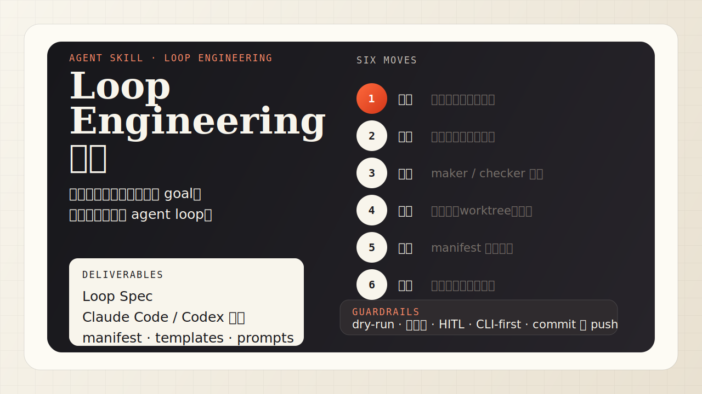

<div align="center">

# Loop Engineering ｜ 愚公

> *「别再一轮一轮手动催 Agent 了——把山交给一个会自己挖的循环。」*

[](skills/loop-engineering/SKILL.md)
[](https://skills.sh/LearnPrompt/loop-engineering)
[](skills/loop-engineering/references/codex-render.md)
[](LICENSE)

**Loop Engineering（循环工程）落地脚手架：把一句模糊的「我想自动搞定 X」，装配成 goal、intake、trigger、worktree、maker/checker、connectors、state、verification、guardrails 都齐备的自跑 Loop，最后把可一键执行的命令交到你手上——扳机你自己扣。**

[看效果](#效果示例) · [安装](#快速开始) · [触发方式](#触发方式) · [它和同类有什么不同](#它和同类有什么不同) · [安全边界](#安全边界)

</div>

---



---

## 它解决什么问题

Loop Engineering（循环工程 / 环路工程）是 Prompt Engineering → Context Engineering → Harness Engineering 之后的**第四阶段**：你不再一轮一轮手动提示 Agent，而是**设计一个能自己跑的循环**——自主发现任务、执行、验证、迭代到目标达成。

可问题是，自己手搓一个 loop 很容易翻车：目标写成「优化一下」于是循环永远停不下来；让 Agent 自己给自己打分于是它自我感觉良好地跑偏；忘了设 token 上限于是一夜烧光预算；子 Agent 卡在一个你看不见的权限弹窗上静默挂死。

**愚公**把这些坑都焊进流程。它不替你跑 loop，而是把你的愿望**备料到「一键可发」**：goal 只是停止判据，真正交付的是一张 Loop Components Matrix，把 intake、trigger、worktree、maker/checker、connectors、state、verification、guardrails 全部落到文件、命令和 runtime 配置里。最后那一下扳机，永远是你的祈使句。

## 效果示例

输入一句话：

```text
用鲁班 skill 检测我 GitHub 上所有 skill，做一遍全面升级；
升级过程中遇到的问题，回馈给鲁班让它自己升级。
```

愚公走完六步（采石 → 立志 → 分工 → 通路 → 刻石 → 交令），先交付组件矩阵，再渲染可直接复制的 `/goal` 和 Codex Automation：

```text
Loop Components Matrix
Goal: manifest 无 pending；done 必须有 draft PR；blocked 必须有原因
Intake: REPOS.md 每行一个 skill 仓库，manifest.json 记录状态
Trigger: on-demand drain；反馈 ≥5 条时触发鲁班 self-upgrade issue
Worktree: 每个 skill 独立 worktree，任务终结前不复用
Maker: luban skill 五步打磨，产出报告 + draft PR
Checker: 独立 agent 验收 frontmatter、diff、测试、泄露、反馈质量
Connectors: gh 优先读写 GitHub；文件系统读写 manifest/log/feedback
State: manifest.json + luban-feedback.md + run log
Verification: check-skill-repo.sh、diff <50 行非测试、secret scan
Guardrails: 不 merge、不发版、不删除；先 2 仓 dry-run；高风险 blocked
Runtime: Claude Code /goal；Codex on-demand Automation + background worktree
```

然后才是 runtime handoff：

```text
/goal 读取 REPOS.md 列出的每个 skill 仓库，逐个完成鲁班升级，直到 manifest.json 无 pending：
对每个 skill：① 跑 check-skill-repo.sh ② 鲁班五步出 draft PR（不自动 merge）
③ 独立 checker 验收 ④ 卡点追加进 luban-feedback.md ⑤ 更新 manifest
完成判据：每个 skill 状态 ∈ {done, blocked}；每个 done 有 draft PR；反馈 ≥5 条则对 luban 开 self-upgrade issue
护栏：高风险动作 blocked 交人类；maker/checker 分两个 agent；commit 即 push；优先 gh/curl；先 2 仓 dry-run
```

外加 manifest/feedback/component-matrix 模板、Codex 等价 Automation 配置。完整范例见 [`examples/luban-fleet-upgrade-case.md`](skills/loop-engineering/examples/luban-fleet-upgrade-case.md)。

### 真实验证回放


## 快速开始

```bash
npx skills add LearnPrompt/loop-engineering
```

装完对 Agent 说：

```text
帮我把「<你想反复自动化的事>」做成一个 Loop Engineering 循环，出组件矩阵、Loop Spec 和双 runtime 命令。
```

## 触发方式

- 「做一个 Loop Engineering / 设计一个循环工程」
- 「把这个任务做成 loop / 做成 goal」
- 「让 agent 自己跑、自主迭代到完成」
- 「把每天 triage issues / 依赖升级 / skill 升级做成自动循环」
- 「帮我开 goal / 设计 /goal / 设计 /loop」
- 「愚公，把这件事架成能自跑的」

## 能做什么 / 它会交付什么

| 能力 | 交付物 |
|---|---|
| 装配组件 | Loop Components Matrix：goal、intake、trigger、worktree、maker/checker、connectors、state、verification、guardrails、handoff |
| 锻造 goal | 二元可验证的 `done_when` 清单 + 反 Goodhart 防作弊条款 |
| 架脚手架 | maker/checker prompt、worktree 隔离、连接器、心跳触发、验证门 |
| 持久化状态 | `manifest.json` + 日志，扛上下文压缩、不重复劳动 |
| 双 runtime 渲染 | Claude Code 的 `/goal`·`/loop` + Codex 的 Automations，同一份 Loop Spec 两套命令 |

## 它和同类有什么不同

| 维度 | 普通「帮我写个自动化脚本」 | 愚公 / Loop Engineering |
|---|---|---|
| 目标 | 自然语言描述，易跑偏 | 二元可验证 `done_when`，机器判真假 |
| 组件 | 通常只写 prompt 或脚本 | 组件矩阵先行，入口/触发/隔离/状态/验证全部有落点 |
| 验收 | Agent 自己说「好了」 | maker/checker 分手，独立验收 |
| runtime | 绑死一个 | Loop Spec 中立，Claude Code + Codex 双渲染 |
| 安全 | 容易自动 merge/烧钱 | 高风险动作进停手点，扳机交人类 |

## 安全边界

- **不替你扣扳机**：愚公只渲染命令，开 `goal`/`loop` 是你的祈使句。
- **高风险动作进停手点**：merge、发版、删除、外部写操作一律 blocked 交人类，不进自动判据。
- **不烧冤枉钱**：每个 loop 强制迭代上限 + token 预算 + 首跑 dry-run + 小样本起步。
- **优先 CLI**：子 agent 用 `gh`/`curl`，不默认会弹窗的工具，避免静默卡死。

## 文件结构

```
loop-engineering/
├─ skills/loop-engineering/
│  ├─ SKILL.md                       # 愚公六步法本体
│  ├─ references/
│  │  ├─ loop-spec-schema.md         # runtime 中立的 Loop Spec
│  │  ├─ component-stack.md          # Loop 组件装配清单
│  │  ├─ goal-forging.md             # 二元判据 + 反 Goodhart
│  │  ├─ claude-code-render.md       # → /goal /loop hooks
│  │  ├─ codex-render.md             # → Automations AGENTS.md
│  │  └─ guardrails.md               # token/HITL/worktree/权限弹窗
│  ├─ templates/                     # component matrix / REPOS / manifest / maker / checker / feedback
│  └─ examples/
│     └─ luban-fleet-upgrade-case.md # 鲁班舰队升级 + 鲁班自举 全程范例
├─ README.md · LICENSE · .claude-plugin/marketplace.json
```

## 验证与测试

```text
帮我把「每天给我所有仓库的 CI 失败 triage 一遍并 draft 修复」做成 loop。
```

合格表现：愚公会拒绝模糊判据、逼你把「triage 完」定义成机器可验证的条件，先产出组件矩阵，再产出带 `done_when`、护栏、双 runtime 命令的完整设计，并在最后停手等你开 goal。

## 致谢

Loop Engineering 概念脉络参考 Addy Osmani、Peter Steinberger、Boris Cherny 等人的公开论述；工程纪律（验证门、信任阶梯、停手点、工位纪律）继承自同门 [鲁班 luban-skill](https://github.com/LearnPrompt/luban-skill)。

## License

[MIT](LICENSE)

---

<div align="center">

*移山不靠一锹，靠一个会自己挖的循环。*

</div>

---

<div align="center">

<sub>公众号「卡尔的AI沃茨」 · X @aiwarts · <a href="https://learnprompt.pro/workshop/">learnprompt.pro/workshop</a></sub>

</div>
